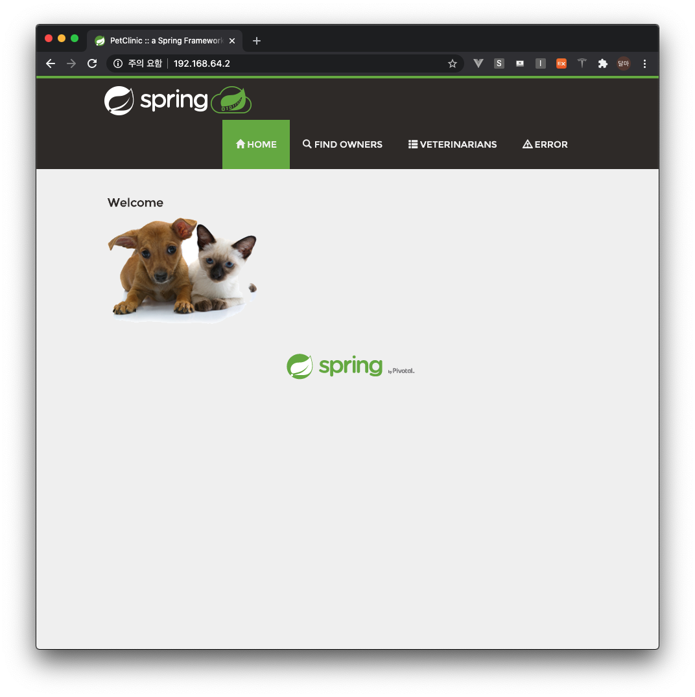

# DEVSOPS 사전과제
> 사전과제 제출용으로  특정 기한 이후 제거 예정입니다

## Installation

OS X :

```sh
brew install minikube
```


## Prepared Minikube

Kubernetes Host 관련 작업을 선행합니다.

미니큐브 시작

```sh
minikube start
minikube ssh
$> sudo su -
#> mkdir /logs
#> chown -R 1000:1000 /logs
```


## Development setup

### git clone


```sh
git clone https://github.com/dalgun/spring-petclinic-data-jdbc.git
```

### docker hub push
#### Maven 사용 

Master Branch 그대로 명령어 실행

```sh
cd spring-petclinic-data-jdbc
mvn clean install
```

#### gradle 사용

Gradle Branch 로 변경 후 빌드

```sh
cd spring-petclinic-data-jdbc
git checkout gradle
gradle jib
```

## Apply for Kubernets local
```sh
cd spring-petclinic-data-jdbc/manifest
kubectl apply -f mysql.yml
kubectl apply -f petclinic.yml
kubectl apply -f ingress.yml
```

## Check
```sh
minikube ip
```



